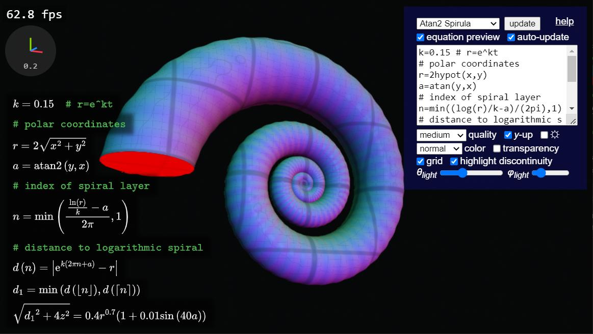
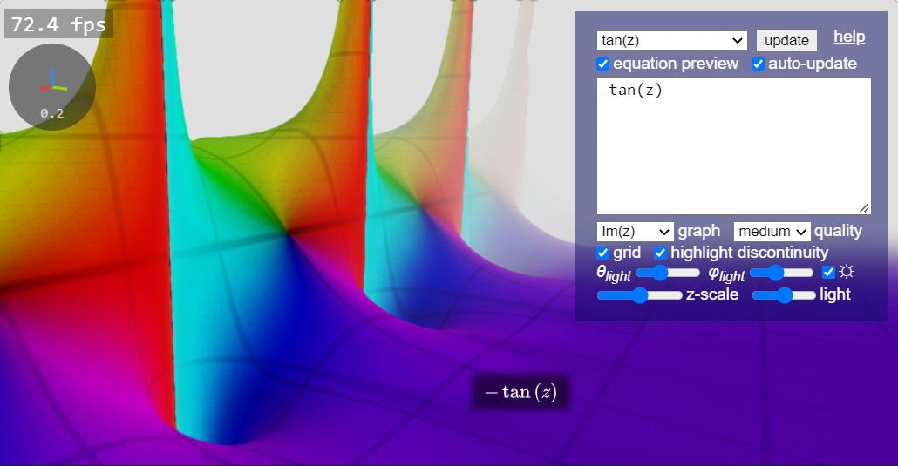
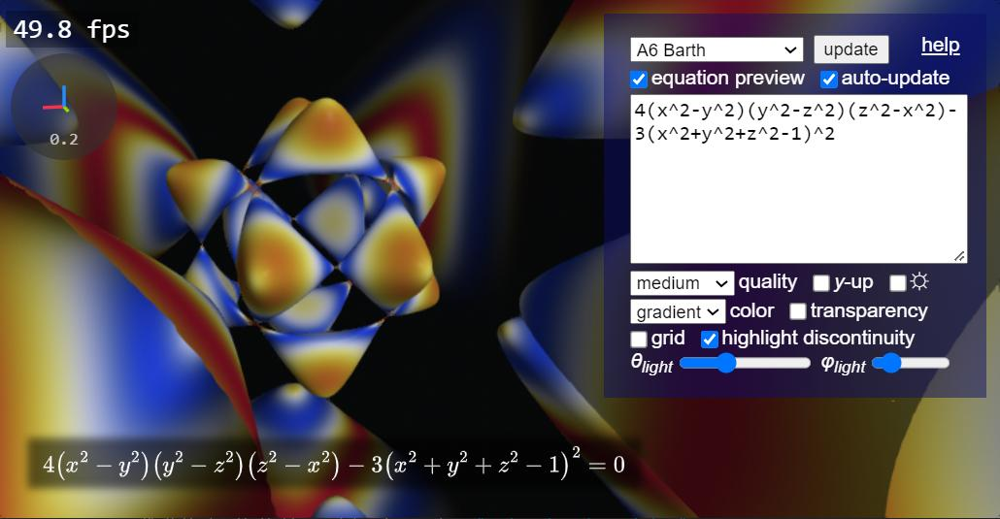
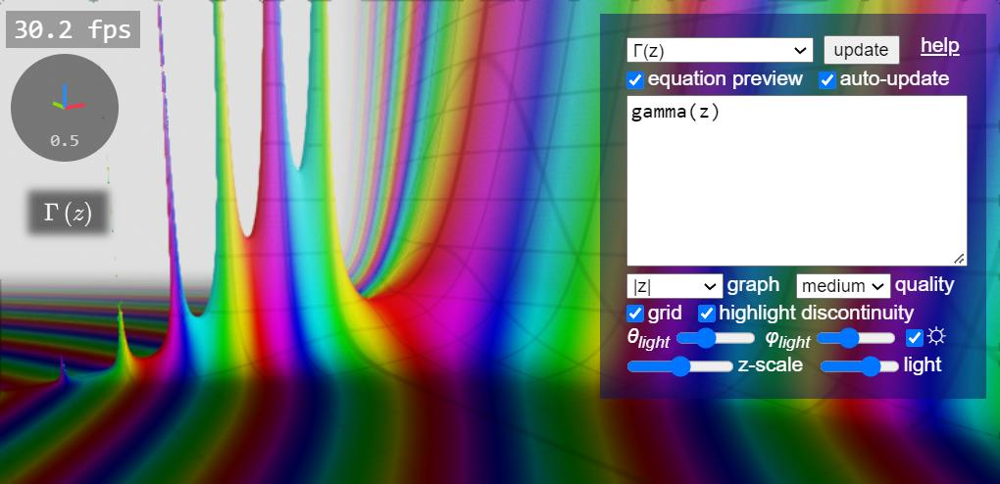
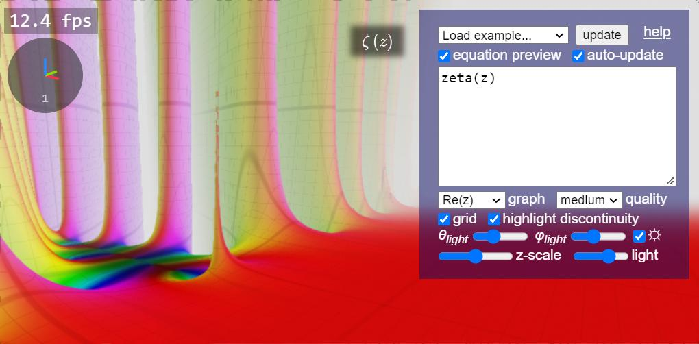

# Spirula

GPU-accelerated function graphers in a web browser, both 3D and 2D.

This is a personal passion project. I couldn't find a 3D graphing calulator with a satisfying 3D implicit surface rendering on the internet, so I decided to make one. I was inspired by raymarching demos on [Shadertoy](https://www.shadertoy.com/).

After my 3D implicit surface grapher received positive feedbacks from other people, I thought, why not extending the same equation parser and renderer to other type of math functions? Under this motivation, I developed the following function graphers:

 - [2D implicit curve grapher](./implicit2/index.html)
 - [3D implicit surface grapher](./implicit3/index.html)
 - [Complex domain coloring grapher](./complex/index.html)
 - [Complex grapher in 3D](./complex3/index.html)

It is important to note that these function graphers are developed completely on my own effort. Since I don't have much knowledge on advanced functions (especially the complex-variabled ones, which I only found their graphs to be visually cool), I cannot guarantee the mathematical pratibility and accuracy of these tools. If you have any suggestions or believe you are experiencing a bug, feel free to [open an issue on GitHub](https://github.com/harry7557558/spirula/issues).

The name "Spirula" comes from the name of [a deep-ocean cephalopod mollusk](https://en.wikipedia.org/wiki/Spirula) with distinctive spiral shells.

----

## Features

The equation parser implements the following features:
 - Function and variable definition
 - Comments (start with a `#`)
 - LaTeX preview
 - Real-time shader generation
 - Automatic differentiation

The 3D graphers implements the following parameters/features:
 - Multiple shading modes
 - Dark and light color themes
 - Speed vs. quality control
 - Axes and grid
 - Red highlight discontinuity
 - Semi-transparent surface shading
 - Anti-aliasing
 - Lighting control

----

## Limitations

These tools have the following dependencies:
 - [WebGL 2](https://webglreport.com/?v=2)
    - `EXT_disjoint_timer_query_webgl2`, an FPS counter will be shown when available
    - *`EXT_color_buffer_float`*, currently not required but is very likely a dependency in the future
 - [MathJax 3](https://www.mathjax.org/), required for rendering equation preview

These tools have the following known issues:
 - Incompatibility across devices for functions with overflow and NaN
 - Reduced quality when rendering surfaces with transparency
 - Ambiguity in resolving functions with conflicting parameter names

Features that may be implemented in the future:
 - Iterative refinement in implicit surface rendering
 - Intersection using interval arithmetic
 - More parameters in viewport control
 - More [domain coloring parameters](https://en.wikipedia.org/wiki/Domain_coloring)
 - Variable sliders
 - Graph sharing via URL
 - Parametric surface grapher

----

## Gallery

Complex domain coloring

Complex domain coloring in 3D

A sextic algebraic surface

The Burning Ship fractal

An algebraic star surface with transparency

Complex 3D plots of the Gamma function and the Riemann Zeta function

